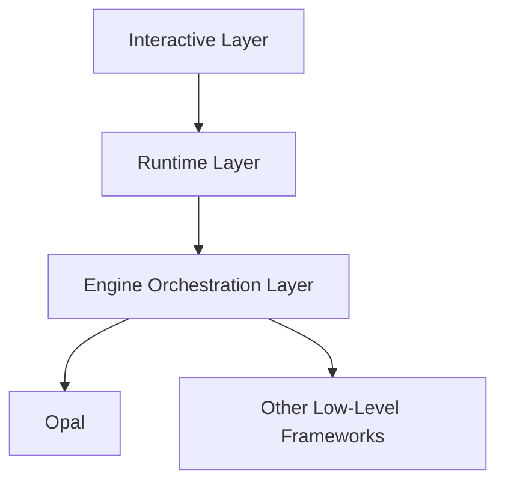
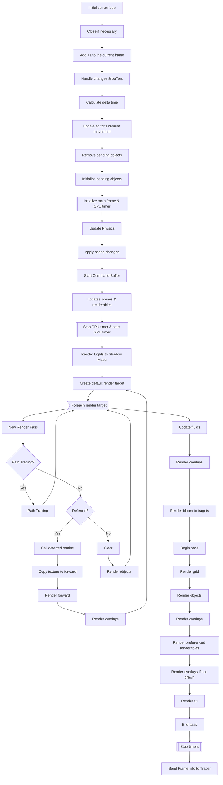
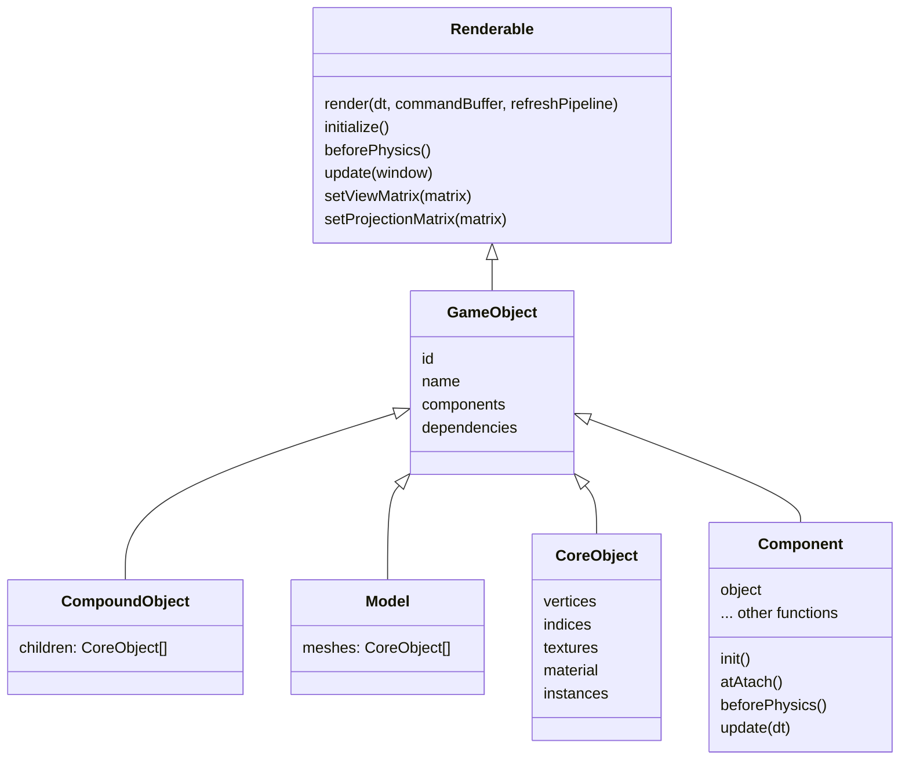

import { Logo } from "@/lib/layout.shared"; 
import { Droplet, Atom, Orbit, Terminal, PanelsTopLeft, AudioLines, Webhook, MountainSnow, Box, Eclipse, TestTubeDiagonal } from "lucide-react";

In this article, we will explore the core concepts of Atlas, including the rendering pipeline, scripting, and native code. Understanding these concepts is essential for creating high-quality games and applications using Atlas.

## Overall Structure
Atlas is divided into four main frontiers that interact with each other to create a complete game engine. These frontiers are follow the following diagram:



## The Atlas Runtime
### Context

The context is the central component of the Atlas Runtime. It manages the state of the application from the view point of the runtime. 
It basically does one important thing. And that thing is controlling all the non-graphic changes that are happening in the game. 
The context receives the project that is created by the interactive layer, it loads the project, and then it creates the window and the engine orchestration layer. 
Finally, it loads with QuickJS everything that is needed to run TypeScript. And it sets this scene and runs the final game. This is very important because the context is basically the kickstart of the game and not just a kickstart but the one that is going to react to every change that happens in the game according to scripts. 
The context is the one that it's used then to run modules or components.

This is an incredibly important part of the Atlas Runtime and probably one of the most important parts of the Atlas engine. 

### Window

It may not seem so, but in Atlas, the window is the one that owns all the objects, and it is the one that runs every frame. 
Each frame that is run runs through a Window object, which exposes a method that allows interactive layers to set up the engine. 
This allows the runtime to instruct when it wants a frame and renders the whole frame with all of its variants and objects.
 The window also creates and sets up all intermediate layers with all the other libraries. 
 This means that it is the basic engine orchestration layer from which all the frames are rendered.

### A Frame Render

This is a graph of every little step that happens in a frame render. It is important to understand this because it is the one that is going to be used to render every frame in the game.



This may seem like a lot, but it is important to understand that this is the basic flow of how a frame is rendered in Atlas.

## The Object Model
### Renderables
A renderable is the basic unit of rendering in Atlas. It is an object that is initialized and then rendered to the screen. Renderables should implement a total of six functions, although just one is required to be implemented.

- `Renderable::render(dt, commandBuffer, refreshPipeline)`: This function is called every frame and is responsible for rendering the object to the screen. It receives the delta time, a command buffer, and a boolean indicating whether the pipeline should be refreshed.
- `Renderable::initialize()`: This function is called when the object is initialized and is responsible for setting up the object. It is called once when the object is created.
- `Renderable::beforePhysics()`: This function is called before the physics update and is responsible for updating the object before the physics simulation. It is called every frame.
- `Renderable::update(window)`: This function is called every frame and is responsible for updating the object. It receives the window object and is called every frame.
- `Renderable::setViewMatrix(matrix)`: This function is called every frame and is responsible for setting the view matrix of the object. It receives a matrix and is called every frame.
- `Renderable::setProjectionMatrix(matrix)`: This function is called every frame and is responsible for setting the projection matrix of the object. It receives a matrix and is called every frame.

All rendering objects should implement at least the `Renderable::render` function, as it is the one that is responsible for rendering the object to the screen. The other functions are optional and can be implemented as needed.

### Game Objects
A game object is a higher-level abstraction from renderables that allow them to have components, also known as modules or extensions. These components can be anything from physics, audio, or even custom logic. Game objects are the basic building blocks of a game and are responsible for managing their components and rendering themselves to the screen.

### Other object types
Arguably, the most important object type in Atlas is the `CoreObject`. This object is the base class for all objects in Atlas and it is an extension to a GameObject capable of building pipelines, vertices and rendering itself to the screen.
It also contains a set of functions for textures and instances.

Also, there are two other types of objects:
- `CompoundObject`: This object is basically a collection of objects that can be rendered together. It is used to group objects together and render them as a single object.
- `Model`: A model is a collection of meshes that are rendered together but come from a 3D model file.

### Components

A component is a unit of functionality that can be added to a game object. There are two types of components in Atlas: `Component` and `TraitComponent<T>` but they fulfill the same purpose.
The lifecycle of a component can be summarized as follows:
```mermaid
flowchart TD
    A[GameObject adds component] --> B[`component.object = owner`]
    B --> C[atAttach() is called]
    C --> D[init() is called]
    D --> E[beforePhysics() is called every frame]
    E --> F[update(dt) is called after physics]
    F --> G[collision, signals and other callbacks are executed]
```

Components can react to events, collisions and signals with the following functions:
- `onCollisionEnter(other: GameObject)`
- `onCollisionExit(other: GameObject)`
- `onCollisionStay(other: GameObject)`
- `onSignalReceive(signal: string, sender: GameObject)`
- `onSignalEnd(signal: string, receiver: GameObject)`
- `onQueryReceive(queryResult: QueryResult)`

A `TraitComponent<T>` is a component that just works with a specific type of object. It is used to create components that are specific to a certain type of object, such as a `CameraComponent` that only works with `Camera` objects.

### Type hierarchy of objects


### Instancing
In graphics, an instance is defined as a copy of an object that can be rendered multiple times with different transformations, materials, or other properties without allocating new memory for the object.
This is powerful for multiple reasons, but the most important one is that it allows for a significant performance boost when rendering large numbers of objects that share the same geometry and material.

The most important thing to know about instancing in Atlas is that it is not just a copy of an object, but it is a copy of the object that can be rendered multiple times with different transformations, materials, or other properties without allocating new memory for the object.
But the memory stays the same. Therefore, `Instance` is not equal to `CoreObject`.

## Materials

Matrials in Atlas are a set of properties that define how an object is rendered. They can be used to define the color, texture, and other properties of an object. Materials can be shared between objects, allowing for efficient rendering of multiple objects with the same material.

In Atlas, materials are defined using a set of properties that can be set on the material's material. These properties include:
- `albedo`: The base color of the material.
- `metallic`: The metallic property of the material, which determines how much the material reflects light.
- `roughness`: The roughness property of the material, which determines how rough or smooth the material appears.
- `ao`: The ambient occlusion property of the material, which determines how much light is blocked in the material.
- `reflectivity`: The reflectivity property of the material, which determines how much light is reflected by the material.
- `emissiveColor`: The emissive color property of the material, which determines how much light is emitted by the material.
- `emissiveIntensity`: The emissive intensity property of the material, which determines how much light is emitted by the material.
- `normalMapStrength`: The normal map strength property of the material, which determines how much the normal map affects the material.
- `useNormalMap`: A boolean property that determines whether the normal map is used in the material.
- `textureScale`: The texture scale property of the material, which determines how much the texture is scaled on the material.
- `textureOffset`: The texture offset property of the material, which determines how much the texture is offset on the material.
- `transmittance`: The transmittance property of the material, which determines how much light is transmitted through the material. *(Only in the path tracing pipeline)*
- `ior`: The index of refraction property of the material, which determines how much light is bent when it passes through the material. *(Only in the path tracing pipeline)*

### Using textures instead of properties

To use a texture instead of a property, you can set the texture on the material's material via the editor.

## Subsystems
Atlas is composed of multiple subsystems that work together to provide a complete game engine. These subsystems include the rendering pipeline, physics engine, audio engine, and more. Each subsystem is responsible for a specific aspect of the game engine and can be used independently or in conjunction with other subsystems.
Take a look at them here:

<Cards>
    <Card title="Atlas Engine" description="The engine itself, responsible for rendering logic, controls, and state management." icon={<Logo />} href="/engine" />
    <Card title="Aurora" description="A realistic terrain creation and reconstruction framework." icon={<MountainSnow />} href="/aurora" />
    <Card title="Bezel Native" description="A physics simulation framework for realistic object interactions." icon={<Atom />} href="/aurora" />
    <Card title="Bezel Jolt" description="A fast and efficient physics engine for real-time simulations based on the Jolt project." icon={<Orbit />} href="/aurora" />
    <Card title="Atlas CLI" description="A simple and easy to use command-line interface for managing your Atlas projects." icon={<Terminal />} href="/aurora" />
    <Card title="Atlas Editor" description="A visual editor for creating and editing your Atlas projects." icon={<PanelsTopLeft />} href="/aurora" />
    <Card title="Finewave" description="A framework for handling audio and music in your games." icon={<AudioLines />} href="/aurora" />
    <Card title="Graphite" description="A UI framework so that you can create beautiful user interfaces." icon={<Webhook />} href="/aurora" />
    <Card title="Hydra" description="An atmosphere framework that provides realistic sky, weather, and water effects." icon={<Droplet />} href="/aurora" />
    <Card title="Opal" description="A core rendering framework that is the backbone of the Atlas Engine, abstracting Vulkan, Metal and OpenGL." icon={<Box />} href="/aurora" />
    <Card title="Photon" description="A path tracing and global illumination system for creating realistic lighting in your scenes." icon={<Eclipse />} href="/aurora" />
    <Card title="Tracer" description="An application and framework for debugging your projects." icon={<TestTubeDiagonal />} href="/aurora" />
</Cards>