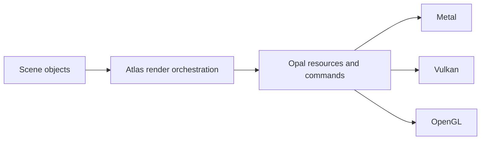

Opal is the rendering foundation beneath Atlas. It maps a shared resource and command model to Metal, Vulkan, or OpenGL so the engine can keep the same scene and object APIs across graphics backends.

Most game projects do not call Opal directly. Atlas creates the context, device, render targets, passes, pipelines, buffers, and command buffers, then schedules rendering for scene objects and higher-level systems such as Photon, Hydra, Aurora, and Graphite.

## Select a backend

Choose the project backend in `project.atlas`:

```toml
backend = "AUTO"
```

Valid values are `AUTO`, `METAL`, `VULKAN`, and `OPENGL`. `AUTO` selects Metal on Apple platforms and Vulkan elsewhere. A CLI command can override the manifest for a particular build:

```bash
atlas build --backend VULKAN
atlas clangd --backend VULKAN
```

When building Atlas itself, select the same value with CMake:

```bash
cmake -S . -B build -G Ninja -DBACKEND=METAL
```

Metal is available on Apple platforms. Vulkan requires a Vulkan loader or SDK and SPIRV-Cross development support. OpenGL is useful for compatibility but exposes a different feature ceiling than modern Metal and Vulkan paths.

## Understand the rendering layers

Atlas decides what to render and in which order. Opal performs the backend work:



The central Opal concepts are:

- `Context` and `Device` establish the graphics environment.
- `Texture` and `Buffer` own GPU resources.
- `ShaderProgram` and `Pipeline` define programmable stages and fixed render state.
- `Framebuffer` and `RenderPass` describe render destinations and attachment work.
- `CommandBuffer` records passes, draws, compute dispatches, resolves, and submission.

A normal command sequence starts a command buffer, begins a render pass, binds the pipeline and drawing state, issues draws or compute work, ends the pass, and commits the buffer.

## Use Opal through Atlas

For ordinary project code, create Atlas textures, materials, meshes, models, and render targets. Those types translate into Opal resources internally. Renderer selection, deferred compatibility, and pipeline refresh remain centralized in Atlas.

That separation matters when writing custom rendering code: scene ownership and frame scheduling belong to Atlas, while backend-neutral GPU operations belong to Opal. Avoid placing Metal-, Vulkan-, or OpenGL-specific assumptions in game objects if the project is intended to run on several backends.

## Pick a rendering mode

The Opal backend and renderer mode are separate choices. `backend = "METAL"` selects the graphics API; `[renderer].default = "deferred"` or `"pathtracing"` selects the high-level rendering path. Photon builds path tracing and global illumination above Opal rather than replacing it.
